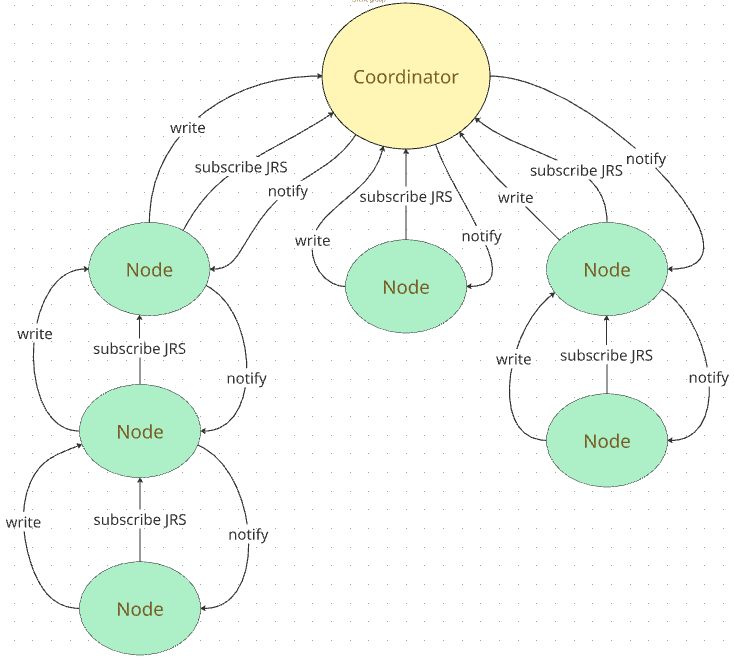

# jelly-BLE

<div align="center">


**A BLE Network Implementation for IoT Technologies Course**

*Facultad de Ingeniería - Universidad de la República, Uruguay*

[Features](#features) • [Architecture](#architecture) • [Getting Started](#getting-started) • [Documentation](#documentation) • [Contributing](#contributing)

</div>

---

## 📋 Overview

Jelly BLE is a Bluetooth Low Energy network project that implements a hierarchical tree topology. Nodes can automatically discover and connect to form a jelly-like network, forwarding packets bidirectionally and measuring Round-Trip Time (RTT) across the network.

---

## ✨ Features

- 🌳 **Hierarchical Jelly Topology** - Automatic parent-child relationship management
- 🔄 **Bidirectional Communication** - Packets flow upward and downward through the network
- ⏱️ **RTT Measurement** - Built-in round-trip time calculation
- 🔌 **Dual Role Nodes** - Nodes act as both central and peripheral simultaneously
- 📡 **Multiple Connections** - Coordinator supports multiple simultaneous connections
- 🔍 **Automatic Discovery** - Nodes automatically scan and connect to parents
- 💾 **Custom GATT Service** - Jelly RTT Service (JRS) for packet forwarding

---

## 🏗️ Architecture

### Network Topology



### Device Roles

#### Coordinator
- Acts as the root of the network
- Accepts multiple connections
- Echoes packets back to sender
- Advertises as "Jelly BLE Coordinator"

#### Node
- **As Peripheral:** Accepts one child connection
- **As Central:** Scans and connects to one parent
- Forwards packets upward (incrementing counter)
- Forwards packets downward (decrementing counter)
- Advertises as "Jelly BLE Node"

---

## 📁 Project Structure

```
jelly-ble/
├── shared/                      # Shared code between coordinator and nodes
│   ├── ble_common.c/h          # BLE initialization and advertising
│   ├── button.c/h              # Button handling
│   ├── led.c/h                 # LED control
│   ├── jelly_rtt_service.c/h   # Custom GATT service
│   └── rtt_manager.c/h         # RTT timestamp management
│
├── coordinator/
│   └── src/
│       ├── main.c              # Coordinator entry point
│       └── ble_callbacks.c     # Connection callbacks
│
└── node/
    └── src/
        ├── main.c              # Node entry point
        ├── ble_callbacks.c     # Connection callbacks
        ├── scanning.c          # Parent discovery
        └── connection_manager.c # Connection management
```

---

## 🚀 Getting Started

### Prerequisites

- nRF Connect SDK (v3.0.0)
- Nordic development boards (nRF5340 series, nRF52840 dongle)
- Segger J-Link debugger
- VS Code with nRF Connect extension

## 📡 Jelly RTT Service (JRS)

### Service UUID
```
6f6a0001-8e3d-4d2f-a3a1-1234deadbeef
```

### Characteristic UUID
```
6f6a0002-8e3d-4d2f-a3a1-1234deadbeef
```

### Packet Format

```c
typedef struct __packed {
    uint8_t counter;  // Increments upward, decrements downward
} jrs_pkt_t;
```

### Operations

- **Write Without Response:** For upward communication (node → coordinator)
- **Notify:** For downward communication (coordinator → node)

---

## 🔄 Communication Flow

### Example: 3-Node Chain

```
[Leaf Node] → [Intermediate Node] → [Coordinator]
```

**Upward Journey:**
1. Leaf node button press → sends `counter=0`
2. Intermediate node receives → increments to `counter=1`
3. Coordinator receives → echoes back `counter=1`

**Downward Journey:**
4. Intermediate node receives notification → decrements to `counter=0`
5. Leaf node receives `counter=0` → calculates RTT

### RTT Calculation

```c
// On button press (leaf node)
rtt_store_timestamp();
send_packet(counter=0);

// On receiving counter=0 (same leaf node)
rtt = k_uptime_get() - stored_timestamp;
LOG_INF("RTT: %llu ms", rtt);
```

---

## 🔌 Hardware Setup

### LEDs

| LED | Coordinator | Node |
|-----|-------------|------|
| LED1 | Blink (running status) | Blink (running status) |
| LED2+ | Connection count | Parent connected |

### Buttons

| Button | Coordinator | Node |
|--------|-------------|------|
| Button 1 | Send button state | Initiate RTT measurement |

---

## 📊 API Reference

### Shared APIs

#### BLE Common
```c
void ble_init(void);
void ble_advertising_init(void);
void ble_advertising_start(void);
```

#### Jelly RTT Service
```c
int bt_jrs_init(jrs_rx_cb_t cb);
int bt_jrs_send(struct bt_conn *conn, const jrs_pkt_t *pkt);
int jrs_notify(struct bt_conn *conn, const jrs_pkt_t *pkt);
```

#### RTT Manager
```c
void rtt_manager_init(void);
int rtt_store_timestamp(void);
int rtt_compute_time(void);
```

### Node-Specific APIs

#### Connection Manager
```c
struct bt_conn *get_parent_conn(void);
struct bt_conn *get_child_conn(void);
void set_parent_conn(struct bt_conn *conn);
void set_child_conn(struct bt_conn *conn);
```

#### Scanning
```c
int start_scanning(void);
void connect_to_device(const bt_addr_le_t *addr, 
                      const struct bt_le_conn_param *param);
```

---

## 🔧 Connection Management

### Coordinator

```c
static struct bt_conn *conns[MAX_CONN];  // Array of connections
```

- Accepts up to `CONFIG_BT_MAX_CONN` connections
- Automatically restarts advertising when slots available
- Manages LED indicators for each connection

### Node

```c
static struct bt_conn *parent_conn;  // Upward connection
static struct bt_conn *child_conn;   // Downward connection
```

- Maintains exactly one parent connection
- Maintains at most one child connection
- Automatically reconnects on disconnection

---

## 📝 Logging

All modules support configurable logging:

```c
LOG_MODULE_REGISTER(module_name, LOG_LEVEL_INF);
```

### Log Levels
- `LOG_LEVEL_ERR` - Errors only
- `LOG_LEVEL_WRN` - Warnings and errors
- `LOG_LEVEL_INF` - General information
- `LOG_LEVEL_DBG` - Detailed debugging

### Example Output
```
[00:00:01.234,567] <inf> jelly_coordinator_main: Starting Jelly BLE Coordinator
[00:00:01.456,789] <inf> ble_common: Bluetooth initialized
[00:00:01.678,901] <inf> ble_common: Advertising successfully started
[00:00:05.234,567] <inf> ble_callbacks: Connected
[00:00:05.345,678] <inf> jrs: Packet received: counter=2
[00:00:05.456,789] <inf> jrs: Coordinator sent notification: counter=2
```

---

## ⚠️ Known Limitations

- **Single Parent:** Each node connects to only one parent (no redundancy)
- **No latency-power tradeoff considerations:** Nodes don't evaluate this tradeoff when selecting to which node connect.
- **Limited RTT Slots:** Maximum 8 concurrent RTT measurements
- **No Time Sync:** Timestamps are local, not synchronized across nodes

---

## 📚 Resources

- [nRF Connect SDK Documentation](https://docs.nordicsemi.com/)
