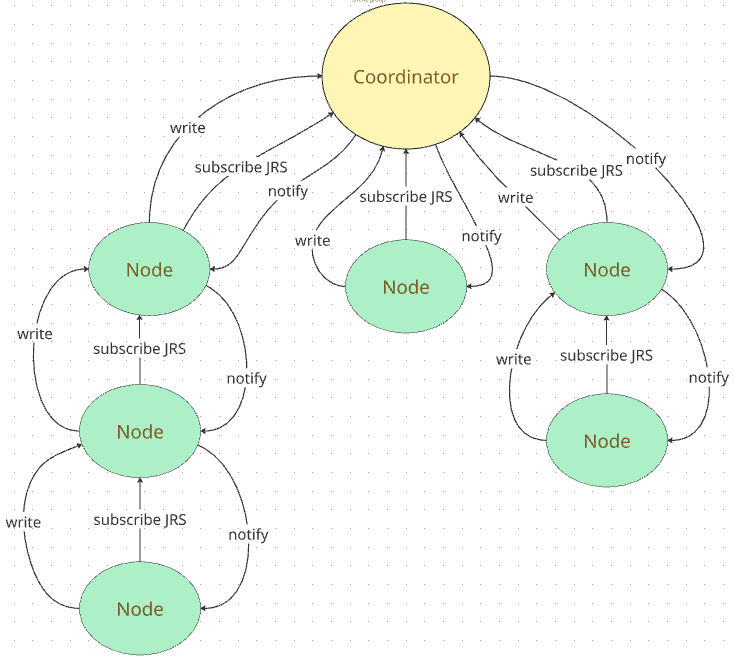

# jelly-BLE

<div align="center">


**A BLE Network Implementation for IoT Technologies Course**

*Facultad de Ingeniería - Universidad de la República, Uruguay*

[Features](#features) • [Architecture](#architecture) • [Documentation](#documentation)

</div>

---

## 📋 Abstract

This work presents **Jelly BLE**, a research prototype exploring hierarchical Bluetooth Low Energy (BLE) mesh networks for next-generation **implantable medical device (IMD) applications**. The system implements a tree-based topology where devices autonomously discover and establish parent-child relationships, forming a network structure reminiscent of a jellyfish: a central coordinator (analogous to an Implantable Pulse Generator - IPG) with multiple sensor nodes distributed along branching "tentacles".

The architecture supports **bidirectional packet forwarding** through a dual-role node design, where each device simultaneously operates as both BLE Central (connecting to one parent) and BLE Peripheral (accepting one child connection). A custom GATT service (Jelly RTT Service) enables packet routing and **Round-Trip Time (RTT) measurement** across multiple network hops, providing insights into latency characteristics critical for medical applications.

This initial implementation leverages the **nRF Connect SDK v3.0.0** on Nordic Semiconductor hardware (nRF5340, nRF52840). The project serves as a foundation for investigating **energy-latency trade-offs**, adaptive topology formation, and connection redistribution policies—future enhancements aimed at optimizing battery life while meeting clinical latency requirements.

**Current Status**: This repository contains the **baseline implementation** with fixed single-parent topology and RTT measurement capabilities. Future work will explore adaptive JellyBLE topology with dynamic connection management based on energy-latency optimization.

---

## 🎯 Introduction

### Motivation: Networks of Implantable Medical Devices

Implantable medical devices, particularly **Implantable Pulse Generators (IPGs)** used in therapies such as cardiac pacing, deep brain stimulation, and spinal cord stimulation, have traditionally operated as standalone, isolated systems. However, emerging clinical needs and technological advances point toward a new paradigm: **coordinated networks of multiple IPGs and implantable sensors** working cooperatively within the human body.

Recent developments, such as Abbott's **Aveir bicameral leadless pacemaker**, demonstrate this trend. The Aveir system implements **intrabody communication via capacitive coupling** between implanted devices and uses Bluetooth Low Energy for external communication with programmers and patient monitoring systems. This represents a significant step toward networked implantable systems.

Future therapies may comprise **multiple implanted devices forming an intra-body network**, enabled by:
- Proliferation of IoT technologies adapted for medical use
- Miniaturization of electronics and sensors
- Advanced closed-loop control requiring sensor fusion
- Remote monitoring and personalized therapy adjustment

However, such networks face unique constraints:
- **Extreme energy limitations**: Battery replacement may require surgery
- **Ultra-low latency requirements**: Critical for real-time therapy delivery
- **Biocompatibility and size constraints**: Limit hardware complexity
- **Reliability requirements**: Medical-grade fault tolerance

### Project Context and Objectives

This project develops a **functional prototype** to explore the technical feasibility of interconnecting multiple IPGs and sensors in a BLE-based network. The technical inspiration comes from the paper *"Low Power Tree Network Implementation using Bluetooth Low Energy Multirole"* (IEEE, 2024), which implements an energy-efficient tree network using BLE multirole capabilities on the same Nordic Semiconductor microprocessor family.

#### Primary Objective

Design and implement a communication network between multiple implantable devices (one IPG and multiple sensors), proposing an **adaptive topology** and evaluating its impact on:
- **Energy consumption**
- **Transmission latency**
- **Scalability**

#### Proposed "Jellyfish" Architecture

The target architecture envisions:
- **IPG (Coordinator)**: Central node maintaining multiple simultaneous connections, with at least one reserved for external communication (programmer)
- **Sensor Nodes**: Low-power devices maintaining up to 2 connections, forming branching "tentacles" of varying depth
- **Dynamic Topology**: Nodes can connect to existing tentacles (longer path, lower IPG load) or form new direct connections (shorter path, higher IPG load)

#### Specific Research Goals

1. **Energy-Latency Trade-off Quantification**: Measure the cost (in energy and latency) of connecting to existing tentacles versus forming new direct connections to the IPG

2. **Adaptive Network Formation Algorithm**: Develop a self-organizing protocol that optimizes a combined metric based on:
   - Estimated energy consumption per node
   - Remaining battery capacity
   - Clinically acceptable latency thresholds

3. **Connection Redistribution Policy**: Implement a mechanism where high-latency nodes can request priority (direct IPG connection), potentially causing other nodes to yield their position if it avoids higher overall energy cost

### State of the Art: BLE Tree Networks

REVISAR

### Jelly BLE: Current Implementation vs. Future Vision

This repository represents **Phase 1** of the research project:

| Aspect | Current Implementation | Future Work (Objectives) |
|--------|----------------------|-------------------------|
| **Topology** | Fixed single-parent tree | Adaptive jellyfish with multi-parent consideration |
| **Parent Selection** | Coordinator-first, simple retry | Energy-latency optimization algorithm |
| **Connection Management** | Static (1 parent, 1 child) | Dynamic redistribution based on latency/energy |
| **Metrics** | RTT measurement only | Battery estimation, energy profiling, latency guarantees |
| **Node Types** | 2 (coordinator, node) | Role differentiation (IPG, sensor types) |
| **Application** | Generic packet forwarding | Medical data collection with QoS |

#### Design Philosophy of Current Implementation

The baseline implementation prioritizes **simplicity and measurability**:

1. **Single Parent Policy**: Each node connects to exactly one parent
   - Simplifies routing logic
   - Reduces connection overhead
   - Provides baseline for comparison with future adaptive approaches

2. **Coordinator-First Discovery**: Nodes prioritize direct coordinator connection
   - Creates naturally shallow trees (minimizes hops)
   - Establishes worst-case energy consumption baseline (all nodes connected to IPG)

3. **Transparent Packet Forwarding**: Hop-count based on counter increment/decrement
   - No complex routing tables
   - Easy RTT measurement for latency characterization

4. **Native BLE 5.0+**: Leverages modern BLE features without external mesh stacks
   - Realistic for IMD applications (no additional protocol overhead)
---

## ⚙️ Features

- 🌳 **Hierarchical Jelly Topology** - Automatic parent-child relationship management
- 🔄 **Bidirectional Communication** - Packets flow upward and downward through the network
- ⏱️ **RTT Measurement** - Round-trip time calculation
- 🔌 **Dual Role Nodes** - Nodes act as both central and peripheral simultaneously
- 📡 **Multiple Connections** - Coordinator supports multiple simultaneous connections
- 🔍 **Automatic Discovery** - Nodes automatically scan and connect to parents
- 💾 **Custom GATT Service** - Jelly RTT Service (JRS) for packet forwarding

---

## 🏗️ Architecture

### Network Topology



### Device Roles

#### Coordinator
- Acts as the root of the network
- Accepts multiple connections
- Echoes packets back to sender
- Advertises as "Jelly BLE Coordinator"

#### Node
- **As Peripheral:** Accepts one child connection
- **As Central:** Scans and connects to one parent
- Forwards packets upward (incrementing counter)
- Forwards packets downward (decrementing counter)
- Advertises as "Jelly BLE Node"

---

## 📁 Project Structure

```
jelly-ble/
├── shared/                      # Shared code between coordinator and nodes
│   ├── ble_common.c/h          # BLE initialization and advertising
│   ├── button.c/h              # Button handling
│   ├── led.c/h                 # LED control
│   ├── jelly_rtt_service.c/h   # Custom GATT service
│   └── rtt_manager.c/h         # RTT timestamp management
│
├── coordinator/
│   └── src/
│       ├── main.c              # Coordinator entry point
│       └── ble_callbacks.c     # Connection callbacks
│
└── node/
    └── src/
        ├── main.c              # Node entry point
        ├── ble_callbacks.c     # Connection callbacks
        ├── scanning.c          # Parent discovery
        └── connection_manager.c # Connection management
```

---

## 🚀 Getting Started

### Prerequisites

- nRF Connect SDK (v3.0.0)
- Nordic development boards (nRF5340 series, nRF52840 dongle)
- Segger J-Link debugger
- VS Code with nRF Connect extension

## 📡 Jelly RTT Service (JRS)

### Service UUID
```
6f6a0001-8e3d-4d2f-a3a1-1234deadbeef
```

### Characteristic UUID
```
6f6a0002-8e3d-4d2f-a3a1-1234deadbeef
```

### Packet Format

```c
typedef struct __packed {
    uint8_t counter;  // Increments upward, decrements downward
} jrs_pkt_t;
```

### Operations

- **Write Without Response:** For upward communication (node → coordinator)
- **Notify:** For downward communication (coordinator → node)

---

## 🔄 Communication Flow

### Example: 3-Node Chain

```
[Leaf Node] → [Intermediate Node] → [Coordinator]
```

**Upward Journey:**
1. Leaf node button press → sends `counter=0`
2. Intermediate node receives → increments to `counter=1`
3. Coordinator receives → echoes back `counter=1`

**Downward Journey:**
4. Intermediate node receives notification → decrements to `counter=0`
5. Leaf node receives `counter=0` → calculates RTT

### RTT Calculation

```c
// On button press (leaf node)
rtt_store_timestamp();
send_packet(counter=0);

// On receiving counter=0 (same leaf node)
rtt = k_uptime_get() - stored_timestamp;
LOG_INF("RTT: %llu ms", rtt);
```

---

## 🔌 Hardware Setup

### LEDs

| LED | Coordinator | Node |
|-----|-------------|------|
| LED1 | Blink (running status) | Blink (running status) |
| LED2+ | Connection count | Parent connected |

### Buttons

| Button | Coordinator | Node |
|--------|-------------|------|
| Button 1 | Send button state | Initiate RTT measurement |

---

## 📊 API Reference

### Shared APIs

#### BLE Common
```c
void ble_init(void);
void ble_advertising_init(void);
void ble_advertising_start(void);
```

#### Jelly RTT Service
```c
int bt_jrs_init(jrs_rx_cb_t cb);
int bt_jrs_send(struct bt_conn *conn, const jrs_pkt_t *pkt);
int jrs_notify(struct bt_conn *conn, const jrs_pkt_t *pkt);
```

#### RTT Manager
```c
void rtt_manager_init(void);
int rtt_store_timestamp(void);
int rtt_compute_time(void);
```

### Node-Specific APIs

#### Connection Manager
```c
struct bt_conn *get_parent_conn(void);
struct bt_conn *get_child_conn(void);
void set_parent_conn(struct bt_conn *conn);
void set_child_conn(struct bt_conn *conn);
```

#### Scanning
```c
int start_scanning(void);
void connect_to_device(const bt_addr_le_t *addr, 
                      const struct bt_le_conn_param *param);
```

---

## 🔧 Connection Management

### Coordinator

```c
static struct bt_conn *conns[MAX_CONN];  // Array of connections
```

- Accepts up to `CONFIG_BT_MAX_CONN` connections
- Automatically restarts advertising when slots available
- Manages LED indicators for each connection

### Node

```c
static struct bt_conn *parent_conn;  // Upward connection
static struct bt_conn *child_conn;   // Downward connection
```

- Maintains exactly one parent connection
- Maintains at most one child connection
- Automatically reconnects on disconnection

---

## 🧠 Network Formation Algorithm

### Current Implementation

The baseline implementation uses a simple priority-based discovery algorithm:

#### Algorithm 1: Device Scan and Connection (Nodes)

```
On device start:
    Initialize BLE scanning module
    Set filters for "Jelly BLE Coordinator" and "Jelly BLE Node"
    Start scanning

When a BLE device is detected:
    IF name equals "Jelly BLE Coordinator" THEN
        Attempt immediate connection
        Reset retry_counter
    ELSE IF name equals "Jelly BLE Node" THEN
        Increment retry_counter
        IF retry_counter == COORDINATOR_RETRY_TIMES THEN
            Attempt connection to node
            Reset retry_counter
        END IF
    ELSE
        Register as unknown device (do not connect)
    END IF

If connection error occurs:
    Log error
    Restart scanning

When connection successfully established:
    Register connection as "parent"
    Perform GATT service discovery
    Subscribe to notifications
```

**Parameters**:
- `COORDINATOR_RETRY_TIMES`: Number of scan cycles to wait for coordinator before accepting node connection (default: 10)

**Characteristics**:
- **Greedy approach**: Always prefer direct coordinator connection
- **No load balancing**: Can overload coordinator with many nodes
- **No latency awareness**: Does not consider hop count of intermediate nodes
- **Energy-blind**: Does not estimate battery impact

**Resulting Topology**:
- Shallow trees (depth ≤ 2 typically)
- Coordinator-heavy (many direct children)
- Predictable but suboptimal for energy distribution

See implementation in [scanning.c:80-124](node/src/scanning.c#L80-L124)

### Future Work: Adaptive Jellyfish Algorithm

The planned enhancement will implement **energy-latency aware parent selection** with dynamic connection redistribution. Nodes will:
- Advertise their current hop count and battery level
- Calculate a combined metric weighing energy cost, latency, and load balancing
- Support priority requests from high-latency nodes
- Implement connection yielding to optimize overall network efficiency
---

## 📝 Logging

All modules support configurable logging:

```c
LOG_MODULE_REGISTER(module_name, LOG_LEVEL_INF);
```

### Log Levels
- `LOG_LEVEL_ERR` - Errors only
- `LOG_LEVEL_WRN` - Warnings and errors
- `LOG_LEVEL_INF` - General information
- `LOG_LEVEL_DBG` - Detailed debugging

### Example Output
```
[00:00:01.234,567] <inf> jelly_coordinator_main: Starting Jelly BLE Coordinator
[00:00:01.456,789] <inf> ble_common: Bluetooth initialized
[00:00:01.678,901] <inf> ble_common: Advertising successfully started
[00:00:05.234,567] <inf> ble_callbacks: Connected
[00:00:05.345,678] <inf> jrs: Packet received: counter=2
[00:00:05.456,789] <inf> jrs: Coordinator sent notification: counter=2
```

---


## Phase 2: Adaptive Topology Implementation

### 1. Energy-Latency Trade-off Quantification

**Objective**: Establish empirical models for energy consumption and latency as functions of:
- Number of hops to coordinator
- Connection interval settings
- Packet transmission frequency
- RSSI (link quality)

**Methodology**:
- Instrument nodes with power profiling (Nordic PPK2)
- Vary topology depth (1, 2, 3+ hops)
- Measure: average current, peak current, RTT, packet loss
- Create energy/latency cost functions for optimization algorithm

### 🚀 Future Work

### 2. Adaptive Network Formation

**Objective**: Implement energy-latency aware parent selection algorithm

**Key Tasks**:
- Extend advertising packets to include node metrics:
  - Current hop count to coordinator
  - Estimated battery level (%)
  - Number of downstream children
  - Average RTT measurement
- Implement combined cost metric calculation
- Tune weighting factors based on experimental data
- Validate topology formation under different scenarios

#### 3. Connection Redistribution Policy

**Objective**: Implement dynamic connection reallocation for latency-critical nodes

**Key Tasks**:
- Define priority classes for different sensor types
- Implement negotiation protocol for connection yielding
- Handle edge cases: network partitioning, simultaneous requests
- Ensure stability (avoid oscillation between topologies)

#### 4. Scalability Evaluation

**Objective**: Characterize network limits

**Experiments**:
- Maximum number of nodes before degradation
- Impact of tree depth on overall throughput
- Coordinator processing limits (connection scheduling)
- Network formation time as function of node count

#### 5. Medical Application Layer

**Objective**: Move beyond generic packet forwarding to realistic medical data flows

**Features to implement**:
- Sensor data types (ECG samples, accelerometer, battery voltage)
- Data prioritization and QoS
- Closed-loop control: sensor → coordinator → actuator (IPG)
- Security: encryption, authentication, anti-tampering
- Compliance considerations (IEC 62304 medical device standards)

### Known Limitations (Current Implementation)

- **Single Parent Only**: No redundancy or alternative paths
- **No Energy Awareness**: Parent selection ignores battery impact
- **No Latency Guarantees**: Best-effort forwarding only
- **No Load Balancing**: Coordinator can be overloaded
- **No Time Synchronization**: Timestamps are local
- **No Security**: Plain-text communication (acceptable for research prototype)
- **No Loop Detection**: Topology errors could create routing loops

These limitations are **intentional** for the baseline implementation.

---

## 📚 Research Context

### Academic Supervision

This project is developed within the course **"Tecnologías para la Internet de las Cosas"** at:

**Facultad de Ingeniería - Universidad de la República, Uruguay**

**Author**: Agustín Coitinho
**Supervisors**:
- Andrés Seré
- Leonardo Steinfeld
- Federico Nin

### Potential Applications

While this work focuses on **AIMDs**, this might me applied to:
- Wearable health monitoring networks
- Industrial IoT sensor networks with battery constraints
- Smart building automation in large structures
- Agricultural sensor networks spanning large areas

### Related Publications

**Primary Reference**:
- "Low Power Tree Network Implementation using Bluetooth Low Energy Multirole", IEEE 2024

---

## 📚 Resources

- [nRF Connect SDK Documentation](https://docs.nordicsemi.com/)
- [Project Diagrams](docs/) - Network formation and RTT measurement sequence diagrams
